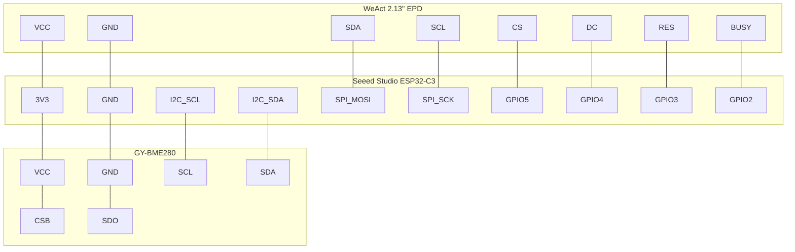

# Weather Station

> [!IMPORTANT]
> This is a toy project for me to learn Rust and embedded development and it's
still under heavy development.

Firmware code for a weather station based on an ESP32-C3 microcontroller and
BME280 sensor.

## Getting Started

### Connection diagram



### Run the code

```bash
$ cargo run --release
initializing I2C...
initializing BME280...
starting loop...
trying to read from BME280...
T: 32.658386 °C
H: 47.545048 %
P: 101351.7 Pa

trying to read from BME280...
T: 32.65711 °C
H: 47.45209 %
P: 101351.7 Pa
```
